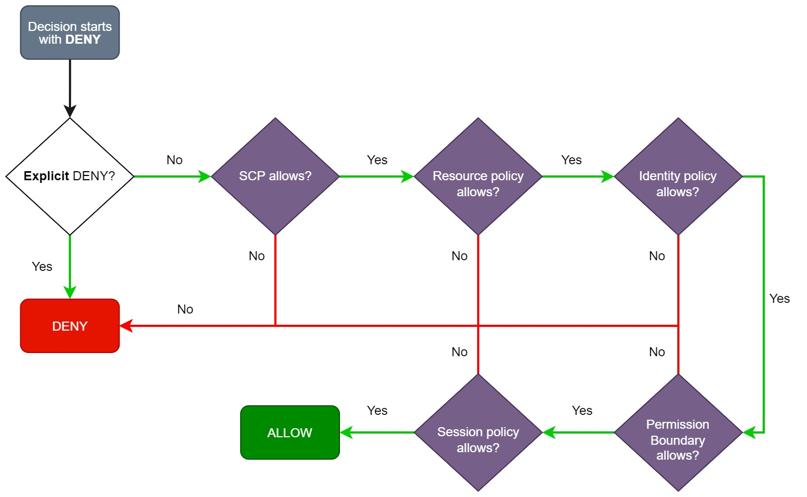
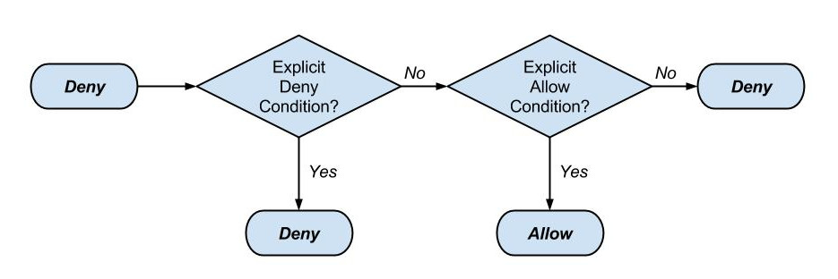

# AWS CloudOps 

## Table of Contents
- [IAM](#iam) ✅
  - [Overview & Concepts](#overview--concepts)
  - [Policies](#policies)
  - [AWS STS](#aws-sts)
  - [RBAC & ABAC](#rbac--abac)
  - [IAM-Notes](#iam-notes)
  - [Interview Possible Scenarios](#interview-possible-scenarios)
- [VPC](#vpc)
- [EC2](#ec2)
- [Elastic Load Balancer (ELB)](#elastic-load-balancer-elb)
- [Auto Scaling Group (ASG)](#auto-scaling-group-asg)
- [S3](#s3)
- [RDS](#rds)
- [Route 53](#route-53)
- [CloudFormation](#cloudformation)
- [CloudWatch](#cloudwatch)
- [Systems Manager](#systems-manager)
- [AWS Config](#aws-config)
- [CloudTrail](#cloudtrail)

# ***`Identity Access Management (IAM)`***
- IAM control **who** can do **what** on **which** resources
- Used to manage secure **authentication** and **authorization** for AWS resources.

## Overview & Concepts
- `Users`: User who interact with AWS Console or Using CLI/API

- `Groups`: Collection of users share same permissions

- `Roles`: identity with specific permissions that can be assumed by trusted entities (users, services, other accounts). 
    - no long-term credentials. Instead, AWS generates temporary security credentials (STS) when a role is assumed.
    - Components: 
        - Trusted Entity: 
        - Permission: permission of the role
        - Session Token Duration
        - Session Policies: 
            - Optional policies provided when assuming a role.
            - To further restrict permissions for that session.
            - Can't give more permissions
    - Use Cases: EC2 instance profiles, cross-account access, Lambda execution.

- `Policies`: JSON document tell which permissions granted for the user/group/role


- `Permissions`: the actual action that an entity can do. Ex: GetEc2

## Policies
- Policy Structure:
    - Version
    - Statement: list of policies elements (list(map)) defines a set of permissions
        - Sid
        - Effect
        - Action
        - Principal
        - Resources
        - Condition

```json
// Policy_1 Identity-Based Customer Managed Polices
{
  "Version": "2012-10-17",
  "Statement": [
    {
      "Sid": "AllowS3ReadOnly",
      "Effect": "Allow",
      "Action": [
        "s3:GetObject",
        "s3:ListBucket"
      ],
      "Resource": [
        "arn:aws:s3:::your-bucket-name",
        "arn:aws:s3:::your-bucket-name/*"
      ],
      "Condition": {
        "StringEquals": {
          "aws:RequestedRegion": "us-east-1"
        }
      }
    },
    {
        "Sid": "AllowEc2List_Customer_Made_policy",
        "Action": "ec2:DescribeInstances",
        "Effect": "Allow",
        "Resource": "ec2:*"
    }
  ]
}
// Policy_2 Resource Based Policy
{
    "Version": "2012-10-17",
    "Statement": [
    {
      "Sid": "S3_ResourceBased Policy",
      "Effect": "Allow",
      "Principal": {
        "AWS": "arn:aws:iam::111122223333:root"
      },
      "Action": [
        "s3:GetObject",
        "s3:ListBucket"
      ],
      "Resource": [
        "arn:aws:s3:::your-bucket-name",
        "arn:aws:s3:::your-bucket-name/*"
      ],
    }
  ]
}
// Policy_3:Trust Policy
{
    "Version": "2012-10-17",
    "Statement": [
        {
            "Effect": "Allow",
            "Action": [
                "sts:AssumeRole"
            ],
            "Principal": {
                "AWS": "258049740213",
                "Service": [
                    "ec2.amazonaws.com"
                ]
            }
        }
    ]
}

```

<div style="text-align: center;">
</div>

- We have 
  - Identity-Based -> Permission Policy 
  - Resource-Based -> Permission Policy 
  - Trust Policy 
  - Session Policy
  - Permissions Boundaries -> Restriction Policy
  - Service Control Policies SCP ->  Organization Policy  

- `IAM Identity-Based Permission Policies`
    - Types:
        - Managed Policies: Managed by AWS, No Edit
        - Customer Managed Polices: Created by customer, Editable 
        - Inline Policies: once for user, extend specific user permissions
- `Resource-Based Permission Policies`
    - Used When sharing resources across accounts or services.
    - Use condition keys like aws:SourceIp, aws:PrincipalArn
    - Services That Support Resource-Based Policies:
        - ***S3 , Lambda, SNS, SQS, KMS & API Gateway***
    - Policy content:
        - *Principal* **→** Who can access the resource
        - *Action + Resource* **→** What they can do

- `Permissions Boundaries`
    - Restrict what IAM users or roles can do, even if a policy allows more.
    - An identity can only perform actions allowed by both its identity policy AND the permissions boundary
    - Used to avoid Privilege Escalation
    - A user cannot give/create another user permission more than what he has
    - Ex: 
      - User1 (IAM full access + No EC2 + No Perm Boundaries)
      - user1 can create another user with EC2 permission
      - If User1 has Perm Boundaries, then cant create a user with access that he doesn't have.

- `Service Control Policies (SCPs)`
    - Organizational control over accounts.
    - ***Set Permission Boundaries, still need IAM to grand permissions***

- `Session Policies` 
    - Limit the existing permissions to specific level
    - only applied during a session that’s created via AWS STS (Security Token Service) — and STS sessions can only be created using a role or certain federated mechanisms.

- `Trust Policy`
  - This is a policy attached to a role to determine who can assume this role user/service
  - It has **Principle and No Resources**

- `Allow & Deny`

<div style="text-align: center;">
</div>

- Password Policy: policy for restricting how complex user passwords should be.
- Access Keys: Used for CLI/SDK access
- MFA: 
  - Enable for Root
  - For Users, they enable it on their own.

## AWS STS
- STS allows you to request temporary security credentials to access AWS services. 
- It’s essential for secure, temporary, least-privilege access without long-term credentials.

| Problem                                   | STS Solution                        |
| ----------------------------------------- | ----------------------------------- |
| Long-term credentials are risky           | Use temporary, expiring credentials |
| Need cross-account access                 | Use STS to assume roles             |
| Federated access needed (AD/Google login) | Use STS with IdPs                   |
| Grant restricted session                  | Use session policies                |

---

| Term                      | Meaning                                  |
| ------------------------- | ---------------------------------------- |
| **Temporary credentials** | `AccessKey, SecretKey, SessionToken`     |
| **Session**               | Valid period of an assumed role          |
| **Assume Role**           | Main STS use to switch permissions       |
| **Federated Access**      | Identity provider (Google, AD, SSO)      |
| **Session Policy**        | Extra restrictions on top of role policy |

## RBAC & ABAC
- RBAC:
  - Creating a container of permission as a DevOps Role/Group
  - Give the wanted permission to the whole Role/Group once.
  - Then add user user to (Group). or let user use (role)
  - Implement using **IAM Roles and Groups**.
- ABAC:
  - access is based on matching tags between the identity and resource.
  - Tag a resources and give user tag through identity policy to user/group
  - The Policy should have condition to restrict matching attributes of resource or User
  - We can create a single policy for all user to restrict access based attributes 
  - Good for big scale number of users and resources.

- `RBAC` = IAM roles/groups → static permission.
- `ABAC` = uses tags and conditions in IAM policies. → dynamic permission.


## IAM-Notes
- Assuming role:
    - we should have role with trust policy (who can use the role), and policy with right permission
    - we than can assume the role to generate temp token to use 
    - the Permission of this token based on permission of the role + Session policy permission
- session policy is a policy we can optionally use when assuming a role to have more restricted permissions than the role give 

## Interview Possible Scenarios
- Cross-Account S3 Access Without IAM User Creation
    - S3 resource-based bucket policy with Principal pointing to the external AWS account
- Temporary Access to S3 or EC2 for Contractors
    - S3 only: Use pre-signed URLs to provide temporary, time-limited access.
    - AWS account user: Use STS AssumeRole if allowed, with session policies to restrict permissions.
- Restricting S3 Access Based on IP Address
    - resource-based policy with Condition
- Cross-Account Lambda Invocation Without Role Creation
    - resource-based policy on Lambda

- For Cross-Account access (account A want to assume role in account B)
  - Give Account A permission to Allows the user to call **sts:AssumeRole**
  - Create a Role in Account B with Trust policy that Trust Account A User/s
  - Give the Role the needed Permissions
  - Use AWS CLI to Assume the role to get **AccessKey, SecretKey, SessionToken**


# VPC
- VPC Virtual Private Cloud
- A Logical isolated portion of AWS Cloud Within a Region

## Networking
> OSI Model
- `Layer 1` **–>** Physical: Transmits raw bits over cables or wireless.
- `Layer 2` **–>** Data Link: Moves data between devices on the same network and handles MAC addresses.
- `Layer 3` **–>** Network: Routes packets between networks using IP addresses.
- `Layer 4` **–>** Transport: Ensures reliable delivery of data with TCP/UDP.
- `Layer 5` **–>** Session: Manages connections and sessions between applications.
- `Layer 6` **–>** Presentation: Translates data formats and encrypts/decrypts data.
- `Layer 7` **–>** Application: Provides services for end-user applications (HTTP, SMTP)

> TCP/IP
- `Network Interface / Link` **–>** Sends bits over cables/wireless, handles MAC addresses.
- `Internet` **–>** Routes packets using IP addresses.
- `Transport` **–>** Ensures reliable delivery (TCP) or fast delivery without reliability (UDP).
- `Application` **–>** Provides end-user services like HTTP, DNS

> IPs
- Versions:
  - IPv4 -> 32bits
  - IPv6 -> 128bits

- IP Components:
  - Network IDs -> First portion of the ip
  - Host IDs -> the remaining of the IP 
  - Subnet: portion of the network address pool
  - Subnet Mask: determine which is networkID & HostID

- Private IPs
  - 10.0.0.0/8
  - 172.16.0.0/16
  - 192.168.0.0/24

- `CIDR Classless Inter-Domain Routing`
  - flexible allocation of IP addresses
  - IP/prefix **->** prefix == Subnet Mask in bit-count form. tell the number of network bits

## VPC Core Concepts
- VPC is regional
  - Contain Subnets Private/Public within AZs
  - AWS reserve 5 IPs for itself: first four & Last one
  - Public Subnets (VMs with public Ip & private IP)
  - Private Subnets (VMs with private IP)
- `Internet Gateway`
- `Nat Gateway` (has elastic public IP)
  - Enable Internet access for vms in private subnets.
- `Routing Tables`:
  - Determine how routing happen in your network
  - Main Route for internet access.


- Connection from VM-public to client
    - IGW used to translate the public accessed ip to the vm private IP
    - No direct connection between the VM and client
    - 2 way communication can be started

- Connection from VM-private to google
    - vm send request to nat gateway 
    - Nat do its magic and  replace source ip
    - nat use IGW to talk to google
    - and the connection goes back
    - Only one way connection, only the private vm can init the connect (security)
    - Nat keep a `mapping entry` to keep track of its connections


## NATing
- `SNAT` changes the ***source IP*** address of a packet as it leaves your network. (*MASQUERADE*)
- `DNAT` changes the ***destination IP*** address of a packet as it enters your network.

## Firewalls
- `NACL`: Subnet Level Firewall
    - Can explicitly allow or deny traffic

- `Security Groups`: Instance Level Firewall
    - Allow rules only — everything else is implicitly denied.

### stateful VS statless
- `Stateful`: When a connection is allowed through the firewall in either direction, return traffic matching session table is also allowed
    - ex: if allow tcp port 80, the response will be allowed even it not explicitly defined

- `Statless`: Does not track connection state. Each packet is evaluated independently based only on rules.
    - ex: if allow tcp port 80 the response will not be permitted unless an explicit defined incoming rule.


# EC2 
- 
# Elastic Load Balancer (ELB)
- 
# Auto Scaling Group (ASG)
- 
# S3
- 
# RDS
- 
# Route 53
- 
# CloudFormation
- 
# CloudWatch
- 
# System 
- 
# AWS Config
- 
# CloudTrail
