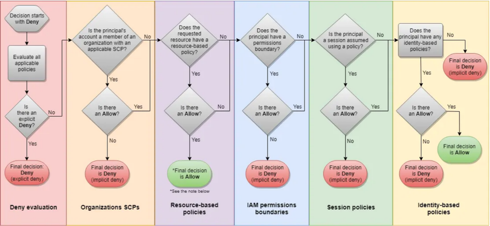
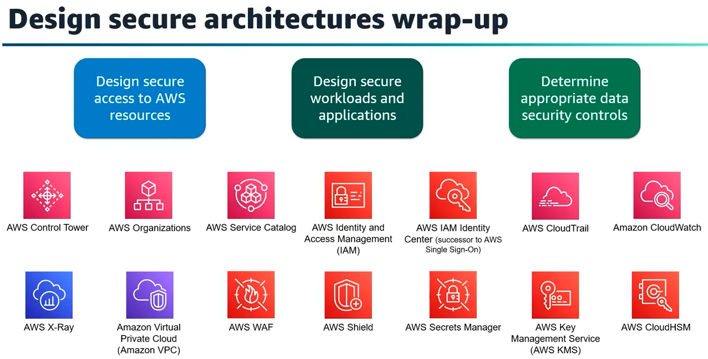
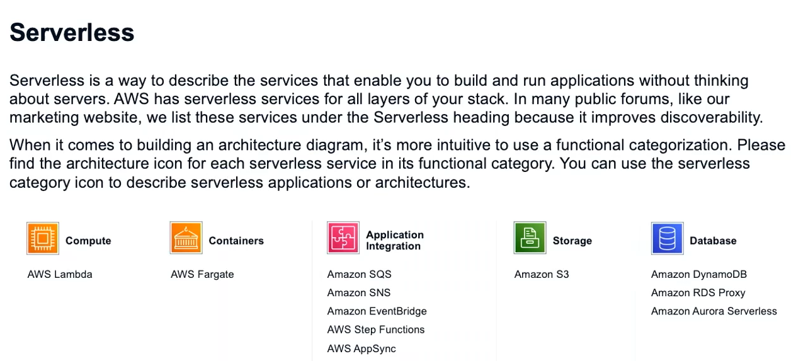

# Exam Domain

## Domain 1: Design Secure Architectures 30%

- 1.1 Design secure access to AWS resources.
- 1.2 Design secure workloads and applications.
- 1.3 Determine appropriate data security controls.
### Focus Points

#### 1.1 Design secure access to AWS resources.

- ***`IAM Identity Center (SSO)`***: For centralized, federated access across multiple AWS accounts and SAML/OIDC integrations.

<div style="text-align: center;">
</div>


- `IAM Identity-Based Policies`
    - Types:
        - Managed Policies: Created once, then attached to many users/roles
        - Inline Policies: once for user, extend specific user permissions
- `Resource-Based Policies`
    - Used When sharing resources across accounts or services.
    - Use condition keys like aws:SourceIp, aws:PrincipalArn
    - Services That Support Resource-Based Policies:
        - ***S3 , Lambda, SNS, SQS, KMS & API Gateway***
- `Permissions Boundaries`
    - Restrict what IAM users or roles can do, even if a policy allows more.

- `Service Control Policies (SCPs)`
    - Organizational control over accounts.
    - ***Set Permission Boundaries, still need IAM to grand permissions***

- `Session Policies` 
    - Limit the existing permissions to specific level
    - only applied during a session that’s created via AWS STS (Security Token Service) — and STS sessions can only be created using a role or certain federated mechanisms.

- If we are assuming a role like admin role -> we get admin permissions, If lower admin role (S3 admin) assume the same role with session policy will have the S3 admin permissions only

> ### ***A trust policy is a special resource-based policy attached to an IAM role that defines who (which principal) is allowed to assume the role.***
> ### IAM User(can assume role) → Trust Policy (User-ARN) → Session Policy → Role Policy (Trust policy)

- ### Resource-based policy Vs IAM role with trust policy.
    - [**Resource**] limited resources
    - [**Resource**] limited control logic
    - [**Resource**] Simple 
    - [**role+trustpolicy**] Multiple service
    - [**role+trustpolicy**] strict temp access
    - [**role+trustpolicy**] Complex

#### 1.2 Design secure workloads and applications.


### Notes 

<div style="text-align: center;">

</div>

## Domain 2: Design Resilient Architectures 26 %

- 2.1 Design scalable and loosely coupled architectures.
- 2.2 Design highly available and/or fault-tolerant architectures.

***`Fault tolerance = Continuous operation under failure`***
***`High availability = system recovers quickly from failures, but might have a brief disruption(Downtime).`***

### Focus Points
- Multi-AZ Design
- Fault-Tolerant & Highly Available Services
- Auto Scaling
- Elastic Load Balancing
    - Distribute traffic across multiple healthy targets.
- Data Layer Resilience
    - RDS Multi-AZ
    - Aurora with failover
    - DynamoDB with global tables for cross-region
- Route 53 with DNS Failover
    - Use Route 53 health checks + failover routing.
- Decouple Using Queues and Events
    - Use SQS, SNS, EventBridge

### Notes 
When focus on Resilience & Fault tolerance, we should think of which option will still work and resist any failure by its nature

<div style="text-align: center;">

</div>

## Domain 3: Design High-Performing Architectures 24 %

- 3.1 storage solutions.
- 3.2 compute solutions.
- 3.3 database solutions.
- 3.4 network architectures.
- 3.5 data ingestion and transformation solutions.

### Focus Points
#### 3.1 storage solutions.
- Object vs Block vs File
    - `S3` = object (massive scale, static assets, backups)
    - `EBS` = block (EC2 storage, OS, DB)
    - `EFS` = file (shared access across instances)

- EBS gp3 vs io2:
    - `gp3` = general workloads (cheap, predictable)
    - `io2` = high IOPS, transactional DBs

- Hybrid Storage Use Cases:
    - Use `Storage Gateway` for on-premises integration
    - `DataSync` for transferring data to AWS

- EFS vs FSx:
    - `EFS` = Linux-based, elastic, shared POSIX file system
    - `FSx for Windows` = SMB access
    - `FSx for Lustre` = HPC, high throughput

#### 3.2 compute solutions.
- Batch & EMR:
    - `Batch` = large-scale, parallel batch jobs (e.g., rendering, simulations)
    - `EMR (MapReduce)` = Big data processing on Hadoop/Spark

- Lambda vs EC2 vs Fargate:
    - `Lambda`: short-duration, event-driven (e.g., S3, API Gateway triggers)
    - `Fargate`: Want serverless + containers, Traffic is bursty or unpredictable, 
    - `EC2`: full control, customizable, used when long-lived processes or specific dependencies exist

- Auto Scaling:
    - `Scaling Policies`: Target Tracking (50% CPU), Step Scaling, Scheduled Scaling
    - Scale based on metrics (CPU, memory, ALB request count)
    - Use Lifecycle Hooks for warm-up or termination tasks

#### 3.3 database solutions.
- RDS:
    - `RDS` = relational DB (MySQL, PostgreSQL, etc.)
    - `Multi-AZ`: synchronous replication → high availability
    - `Cross-region` Read Replicas: for global apps or DR
    - transactions (`OLTP` systems)
- Aurora:
    - Compatible with MySQL/PostgreSQL
    - **Multi-Region Replication** & Automatic **Cross-Region Failover**
    - Supports Aurora `Serverless` v2 (scale to 0)  (useful for `unpredictable` workloads)
    - Aurora `Global Databases` = `Low-latency` global reads
- Read Replicas:
    - `Offload reads`, increase scalability
    - RDS/Aurora allow cross-region replicas
- DynamoDB:
    - Scales automatically to handle millions of requests/sec
    - Capacity Modes:
        - **On-Demand**: `auto-scaling, pay per request` (great for spiky traffic)
        - **Provisioned**: manual throughput settings (WCU/RCU)
- DynamoDB Accelerator (`DAX`):
    - Reduces read latency from milliseconds to microseconds
    - In-memory cache for DynamoDB `ultra-low latency`
- ElastiCache:
    - Add Redis/Memcached for low-latency access
    - Common for session storage and caching query results

#### 3.4 network solutions.
- ALB vs NLB 
    - Use `ALB` for** web-based applications**, `NLB` for **high-performance/low-latency** services.
- Edge Services:
    - `CloudFront`: static content delivery (CDN)
    - `Global Accelerator`: TCP/UDP optimization, static IPs
    - `PrivateLink`: access services privately across VPCs
- Connectivity:
    - `Direct Connect`: private, reliable, high-throughput
    - `Transit Gateway`: hub for connecting multiple VPCs
    - `VPC Endpoints`:
        - **Interface Endpoint**: ENI in your VPC, private connectivity to services (e.g., S3, DynamoDB, SNS)
        - **Gateway Endpoint**: Only for S3 and DynamoDB, creates a route in the route table

#### 3.5 storage solutions.
- Kinesis vs Firehose:
    - `Kinesis Data Streams`: real-time streaming with custom processing
    - `Kinesis Firehose`: managed service, delivers to S3, Redshift, etc.
- `Glue`:
    - Serverless **ETL** (transform .csv → .parquet)
    - Works well with Data Catalog, S3, Athena
- `Athena`:
    - **Query S3** data using SQL (no infrastructure)
- `Lake Formation`:
    - Build secure data lakes with fine-grained access control
- `EMR`:
    - For big data transformations using Spark/Hadoop
- Transfer & Gateway Services:
    - `DataSync`: fast, automated transfer from on-prem
    - `Storage Gateway`: **hybrid cloud** access to AWS storage

### Notes 


## Domain 4: Design Cost-Optimized Architectures 20%

- 4.1 storage solutions.
- 4.2 compute solutions.
- 4.3 database solutions.
- 4.4 network architectures.

### Focus Points
#### 4.1 storage solutions.
- > Storage Solutions:
    - Objects: S3 (lifecycle)
    - Block: EBS (size & Types 'IOPS -> gp2')
    - Filesystem: EFS

- Services that autoscale to save cost
- lifecycle vs inteligent tiering
- Data Migration costs (snowball, datasync, direct link)

- > Keys:
    - Lifecycle Policies to move objects from S3
    - EBS gp3 – better baseline IOPS than gp2 + cheaper
#### 4.2 compute solutions.
- cloudformation (cache) help eliminate cost of calls to DBs 
- EC2 cost plans (spot for stateless, flexible workload & saving -> save plans)

#### 4.3 database solutions.
- Aurora serverless vs Aurora
- RDS -> readreplica better than db incense size

#### 4.4 network solutions.
- VPN site to site better cost direct connect
- vpc peering better cost transite gateway
- Cross region data 
- vpc gateway endpoint for s3 
- nat gateway cost optimize 
- WHen to use ***cloudfront ***

### Notes 

- > ***Storage***
- "Unpredictable access" → S3 Intelligent-Tiering
- "Known lifecycle (30/60/90 days)" → S3 Lifecycle Policies
- “Petabyte transfer with no network” → Snowball
- “Sync NFS/S3 between DC and AWS” → DataSync
- “Private 1 Gbps+ transfer with low latency” → Direct Connect

- > ***Compute***
- *On-Demand*: Unpredictable workload, no long term commitment
- *Spot*: Stateless batch interruptable workload
    - Spot with On-Demand Capacity Fallback 
    - automatically fall back to On-Demand instances
- *Reserved*: Standard RIs & Convertible RIs 
    - Long-term commitment **EC2 only** 
    - Committed to a specific instance family
- *Savings Plans* are a flexible pricing model on **EC2, Lambda Fargate** usage for a commitment to a consistent amount of usage (measured in $/hour) for a 1 or 3 year term.
    - Compute Savings Plans: more families more regions 62%
    - EC2 Instance Savings Plans: same family same region 72% **flexibility across AZs**

- > ***Database***
- "bursty traffic" → Choose Aurora Serverless v2
- "high, steady load" → Choose Aurora Provisioned
- "read performance issue", "offload queries", or "scale reads" → Read Replica
- "CPU bottleneck" or "high write throughput" → Scale DB Instance
- TTL & DAX for cost optimization.
- Use edge caching (CloudFront) to reduce origin costs.

- > ***Network***
- VPN Site-to-Site when: "Need fast setup" or "cost-sensitive hybrid connection"
- VPC Peering when: "2 VPCs only" need direct communication
- VPC Transit Gateway when: "Many VPCs and accounts" involved
- VPC Gateway Endpoint when: Private access & Avoid NAT Gateway data charges **only S3 and DynamoDB**

# Global Notes:


- > Cost Tag Allocation

### EBS 
- volume type
    - gp3 (General Purpose SSD) price/performance cheaper than gp2 with higher baseline performance
    - io2/io1 (Provisioned IOPS SSD)	High-performance DBs	Use only when high IOPS consistency is needed
    - st1 (Throughput HDD)	Big data, log processing Lower cost, good for streaming workloads
    - sc1 (Cold HDD) Archival, infrequent access	Cheapest, but very low performance


### EFS Vs FSx

| Feature | **Amazon EFS** (Elastic File System) | **Amazon FSx** (File System for Windows/Lustre/OpenZFS/NetApp ONTAP) |
| ---- | ------- | -------- |
| **Protocol** | NFS (Linux  | SMB (Windows), Lustre, NFS (ZFS), ONTAP ) |
| **OS Compatibility**  | ✅ Linux only  | ✅ Windows (FSx for Windows), ✅ Linux (FSx for Lustre/OpenZFS)  |
| **Use Case** | Shared file storage for Linux apps| Windows apps, high-perf workloads, ZFS/ONTAP users |
| **Fully Managed**     | ✅ Yes     | ✅ Yes             |
| **Performance**       | Scales automatically| High throughput, low latency options       |
| **Burst Performance** | ✅ Yes – for small workloads  | ❌ No – must provision based on needs   |
| **Backup/Restore**    | Automatic backups | Automatic + user-defined backup support      |
| **Scaling**           | Auto-scale   | You provision storage and performance upfront    |


### EFS (File Storage)
- Use for: shared access, container apps, Linux workloads
- Auto-scales with use
- Types:
    - Standard class storage
    - One Zone class storage: for lower cost (single AZ, less durability)

### RDS vs. Aurora vs. DynamoDB vs. serverless
-  Aurora 
    - Auto-scaling relational DB
    - Serverless SQL backend
    - Need SQL but don’t want to manage capacity
- DynamoDB:
    - Millisecond latency at scale
    - Key-value & NoSQL
    - "Want to auto-delete stale items" → TTL
    - "Need caching for frequently accessed items" → DAX
- RDS:
    - Managed traditional sql 
    - Manual scaling (No Compute Auto Scaling)
    - Support:
        - Storage Auto Scaling
        - Read Replica Auto Scaling
    - Database Sharding for high throughput
    - RDS Stop/Start
    - RDS Proxy: Lambda functions accessing RDS, Improve DB performance under high concurrency

### ***`AWS Storage Gateway`***
- > on-premises Seamless hybrid cloud storage access
- File Gateway
    - For file-based workloads using NFS or SMB to access S3 objects.
    - Use when: Migrating or extending NFS/SMB workloads to S3.
- Volume Gateway
    - For block-based storage presented as iSCSI volumes.
    - Use when: You need block storage (like iSCSI) for hybrid environments.
- Tape Gateway
    - Replaces physical tape libraries with virtual tapes stored in AWS. 
    - Use when: Replacing legacy tape backups with cloud-based VTL.

### ***`DataSync VS Storage Gateway`***
| Feature / Use Case | **DataSync**     | **Storage Gateway**    |
| ----------- | ---------------- | ------------------------------- |
| **Purpose**  | **Bulk data transfer**   | **Seamless hybrid cloud storage access**      |
| **Direction**  | One-way or scheduled sync (on-prem ↔ S3, EFS, FSx) | Continuous file access with local caching |
| **Best For**  | **Migrations, backups, large sync jobs**  | **Hybrid apps needing live file access** |

### ***`AWS Transfer Family`***
AWS Transfer Family is a fully managed service that enables you to transfer files to and from Amazon S3 or EFS using secure file transfer protocols.
- Key Integration Concepts
    - Backend Storage Options: `S3`, `EFS`
    - User Management Options: `AWS Directory Service`, `Service-managed` or `custom identity provider`
    - Security Features: 
        - Data is encrypted in transit (SFTP/FTPS) 
        - IAM policies control
- KeyWords: Legacy System - file transfers to S3 using SFTP 

### ***`Global Accelerator`***
- Global Accelerator uses the AWS global edge network to route traffic on AWS’s backbone — faster and more reliable than public internet.
    - Global Accelerator provides instant failover
    - You need to improve global app performance
    - Your app is TCP/UDP-based (e.g., gaming, financial APIs, media streaming)
    - 2 static IPs
 

### ***`AWS Systems Manager`***
- AWS Systems Manager is a centralized operational hub for managing EC2 instances, on-prem servers, VMs, and other AWS resources. It helps with automation, patching, inventory, configuration, and secure remote access.
- > `SSM Agent`
    - Installed on EC2, on-prem, or VMs to allow control via Systems Manager.
    - Must have proper IAM role attached to instances (AmazonSSMManagedInstanceCore).
    - Agent must be running for SSM to work.
- > Fleet Manager
    - **GUI-based** to view the health and performance status of your entire fleet 
    - View: File system Registry Processes Logs
- > Inventory
    - You can use Inventory to gather metadata about applications, files, components, patches, and more.
- > `Patch Manager`
    - Automate OS patching of EC2 (Windows, Linux) on a schedule.
- > `Run Command`
    - Run commands or scripts on one or many instances.
    - Supports tag-based targeting and IAM control.
- > `Session Manager`
    - Secure shell (SSH)-like access to EC2 without *ports* or *bastion hosts* or *SSH keys*
    - Access instances securely via AWS Console or CLI.
    - No public IP or SSH needed.
- > State Manager    
    - Ensures that instances remain in a defined configuration state.
    - Enforce firewall or software installed on boot
- > Automation 
    - to automate common maintenance and deployment tasks.
- > `Parameter Store`
    - Store configuration data and secure secrets (e.g., API keys, DB passwords).
    - No rotation
- >  OpsCenter
    - Central location for managing operational issues and incidents.
    - Integrated with: CloudWatch AWS Config CloudTrail 

### ***`AWS Secrets Manager`***
- AWS Secrets Manager helps you manage, retrieve, and rotate database credentials, application credentials, OAuth tokens, API keys, and other secrets throughout their lifecycles.
    - **Encryption** with AWS KMS
    - **Automatic Rotation** using **Lambda**
    - IAM policies + **resource** **policies** supported

### ***`AWS Secrets Manager` VS `AWS Systems Manager Parameter Store`***

| Criteria | **AWS Secrets Manager**  | **SSM Parameter Store**   |
| ----- | -------------- | -------------------- |
| 🔄 **Cross-region replication**  | ✅ Yes (automated, supported)     | ❌ No (manual only)    |
| ⚡ **Performance (global access)**   | ✅ Fast with local replicated copies    | ❌ Slower if accessing remote region manually |
| 💰 **Cost optimization**   | ❌ Expensive (per secret & request)  | ✅ Cheap or free (standard params)  |
| 🔐 **Secret rotation**   | ✅ Built-in rotation support    | ❌ Manual only   |
| 🧾 **Audit, versioning**  | ✅ Full auditing with CloudTrail  | Basic audit, no built-in rotation    |
| 🔐 **Encryption at rest**  | ✅ Yes, with KMS      | ✅ Yes, with KMS  |
| 🔁 **High availability / reliability** | ✅ Best-in-class (multi-region support, auto replication) | ⚠️ Needs manual setup for HA                 |
| ⚙️ **Use case**  | Secrets, passwords, tokens, API keys   | App configs, flags, non-sensitive metadata   |

### ***`AWS KMS`***
- > Encrypts plaintext data up to 4096 bytes using a specified KMS key.
- Customer-Managed CMK.
    - full control
    - key policies
    - Audit
    - Cross-account encryption
    - Optional Rotation
- AWS-managed CMK
    - no control over it 
    - Auto-rotated
    - Logging Limited
    - Free
- AWS-Owned CMK: AWS services manage KMS keys on behalf of users, simplifying key management.


- > AWS KMS is not meant to encrypt large files or blobs directly.
    - Use GenerateDataKeyPair & GenerateDataKey

- Envelope Encryption:
1.  KMS to generate a Data Encryption Key (DEK):
    - Call GenerateDataKey API
    - It returns:
        - Plaintext DEK (you use it now)
        - Encrypted DEK (you store it for later)
2. Encrypt your large file/data with the DEK 
3. Store the encrypted data + encrypted DEK side-by-side
4. Decrypt:
    - Decrypt the encrypted DEK with KMS
    - Use the plaintext DEK to decrypt your data

### ***`AWS Config`***
- AWS Config is a resource configuration management service that enables you to track changes, evaluate the compliance of resources, and audit configuration histories for resources across your AWS environment.
- >  Config Rules 
    - Enforce policies across your AWS environment and track configurations for regulatory compliance (
    - ALert for non compliance resources 

### ***`Lambda cold Start VS Warm Start`***
| Feature          | Cold Start                   | Warm Start                  |
| ---------------- | ---------------------------- | --------------------------- |
| **What happens** | New container starts         | Reuse of existing container |
| **Latency**      | Higher (100ms–seconds)       | Low (usually <100ms)        |
| **Triggered by** | First invocation or scale-up | Repeated or frequent use    |
| **Impacted by**  | Large packages, VPC config   | None (already running)      |

"Your Lambda-based API has high latency on the first request..."
→ ✅ Cold start

"You need consistent low-latency responses..."
→ ✅ Use Provisioned Concurrency

"Which option reduces Lambda cold start impact?"
→ ✅ Smaller packages, no VPC, provisioned concurrency

### ***`S3`***
- URL:
```bash
https://<bucket-name>.s3.<region>.amazonaws.com/<key>       # Virtual-hosted–style URL (https://)
http://<bucket-name>.s3-website-<region>.amazonaws.com      # S3 Static Website Hosting URL (http://)
```

### ***`Route53`***
- Hosted Zones: a container for DNS records for a specific domain name
| Type                    | Description                                                                    |
| ----------------------- | ------------------------------------------------------------------------------ |
| **Public Hosted Zone**  | Routes traffic **from the internet** to AWS resources                          |
| **Private Hosted Zone** | Routes traffic **within a VPC** (private DNS resolution for internal services) |

### ***`AWS Amplify`***
- A frontend-focused framework and hosting service to build full-stack web and mobile apps using serverless backends.

### ***`AWS AppSync`***
- A managed GraphQL API service that makes it easy to query, mutate, and sync data from multiple sources in real time.

### ***`AWS App Runner`***
- A fully managed service to deploy and run web apps or APIs directly from source code or containers.
- Features:
    - Auto builds and deploys from GitHub, ECR, or Dockerfile
    - Auto scales up/down based on requests
    - Public endpoint out of the box (HTTPS)
    - Great for developers who just want to deploy an app quickly

### ***`AWS AppFlow`***
- A data integration service that lets you securely transfer data between SaaS apps (like Salesforce, Google Analytics, etc.) and AWS services.
- Features:
    - Supports over 20+ SaaS services: Salesforce, Slack, Zendesk, etc.
    - Transfers data to/from S3, Redshift, DynamoDB, etc.
    - Built-in data transformation, validation, and filters

### ***`AWS Cloud Map`***
- Think of Cloud Map as dynamic service discovery + private DNS, whereas private hosted zones are just static DNS inside a VPC.

### ***`VPC`***
| **Priority**    | **Winner**          | **Why?**                                             |
| --------------- | ------------------- | ---------------------------------------------------- |
| **Security**    | **Transit Gateway** | Centralized control, route table segmentation        |
| **Performance** | **VPC Peering**     | Lower latency, full VPC bandwidth                    |
| **Cost**        | **VPC Peering**     | No hourly cost — best for small setups               |
| **Resilience**  | **Both**            | AWS backbone with HA built-in for both               |
| **Operations**  | **Transit Gateway** | Scales better, easier to manage, centralized routing |


### ***`AWS Network Firewall VS AWS Firewall Manager`***

| Feature  | **AWS Network Firewall**  | **AWS Firewall Manager**  |
| -------- | ------------------------- | ------------------------- |
| **Purpose** | Deploy firewall rules **inside a single VPC** | **Manage and enforce** firewall rules **centrally**|
| **Scope**   | **VPC-level** (inbound/outbound traffic)      | **Multi-account / multi-region** via AWS Org       |
| **Needs AWS Organizations?** | ❌ No                        | ✅ Yes                                            |
| **Manages which services?**  | Just **Network Firewall**    | **WAF**, **Shield**, **Network Firewall**, **SGs** |
| **Traffic Control Type**     | **Stateful + deep inspection** at network layer | ❌ Doesn't inspect traffic — just **enforces policy** |
| **Ideal Use Case**| Secure a **specific VPC**  | Apply rules **across many accounts** automatically   |


### ***`AWS Lake Formation`***
- Lake Formation helps you build, secure, and manage a data lake in AWS, faster and with less effort.
    - Ingesting data into S3
    - Cataloging it (with Glue)
    - Making it queryable (with Athena, Redshift Spectrum, EMR, etc.)

### ***`EC2 Related`***

EC2 Image Builder: Simplified AMI & VM Image Management
AWS Compute Optimizer: analyzes the configuration and utilization metrics of EC2 instances and Auto Scaling groups. It generates optimization recommendations to reduce the cost and improve the performance of your workloads.

### ***`ELBs`***
- AWS Application Load Balancer **Layer 7**: Advanced load balancing of HTTP and HTTPS traffic - HTTP/HTTPS
- AWS Network Load Balancer **Layer 4**: High Performance and Low Latency -  latency-sensitive applications and TCP-based workloads
- AWS Gateway Load Balancer **Layer 3**: or deploying, scaling, and managing third-party virtual appliances, such as firewalls, intrusion detection systems (IDS), and deep packet inspection devices. 


# ToDo


Elastic Beanstalk
Cost Tag Allocation


kinessus strems vs filehose 

Reliability vs Availability vs High availability
- Forgotten services:
    - Costs 
    - Monitoring 
    - CICD


- 8 Sections 
    - 4 Sections *
    - 1 To DO *
    - 4 Sections 
    - 1 TODO * 
- Food
- 8 Sections 
    - 4 Sections
    - 1 To DO
    - 4 Sections
    - 1 TODO