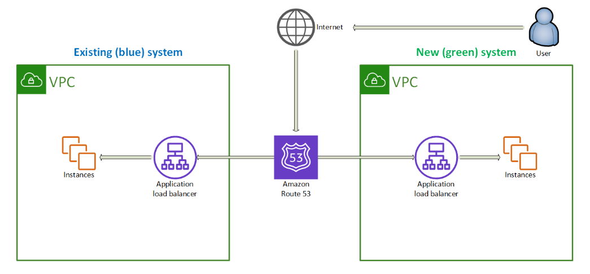

## Table of Contents

- [AWS 2-09: Amazon Database Services](#aws-2-09-amazon-database-services)
  - [Relational Database Service (RDS)](#relational-database-service-rds)
  - [Database Migration Service (DMS)](#database-migration-service-dms)
  - [Amazon DynamoDB](#amazon-dynamodb)
  - [AWS Fully Managed Purpose-Built Database Options](#aws-fully-managed-purpose-built-database-options)
  - [AWS ElastiCache](#aws-elasticache)
- [AWS 2-10: Data and Analytics](#aws-2-10-data-and-analytics)
  - [Ingestion Layer of the Data Pipeline](#ingestion-layer-of-the-data-pipeline)
  - [AWS Glue Batch Processing](#aws-glue-batch-processing)
  - [Amazon Kinesis](#amazon-kinesis)
  - [Amazon Managed Service for Apache Flink](#amazon-managed-service-for-apache-flink)
  - [Amazon MSK (Managed Streaming for Apache Kafka)](#amazon-managed-streaming-for-apache-kafka-msk)
  - [Data Lake](#data-lake)
  - [Amazon EMR (Elastic MapReduce)](#amazon-elastic-mapreduce-emr)
  - [Amazon QuickSight](#amazon-quicksight)
  - [Amazon Athena](#amazon-athena)
  - [Amazon OpenSearch](#amazon-opensearch)
  - [Amazon Redshift](#amazon-redshift)
- [AWS 2-11: Building Serverless Architectures and Microservices](#aws-2-11-building-serverless-architectures-and-microservices)
  - [AWS Serverless Services](#aws-serverless-services)
  - [Microservice Architecture](#microservice-architecture)
  - [AWS Lambda](#aws-lambda)
  - [Containers](#containers)
  - [AWS Elastic Container Service (ECS)](#aws-elastic-container-service-ecs)
  - [Amazon API Gateway](#amazon-api-gateway)
  - [AWS Step Functions](#aws-step-functions)
  - [Amazon SQS (Simple Queue Service)](#amazon-sqs-simple-queue-service)
  - [Amazon SNS (Simple Notification Service)](#amazon-sns-simple-notification-service)
  - [Amazon MQ](#amazon-mq)

## AWS 2-09 Amazon Database Services

### Relational Database Service `RDS`
- Database types:
    - MySQL
    - MariaDB: fork of MySQL
    - PostgreSQL
    - Oracle Database: Supports enterprise applications
    - Microsoft SQL Serve
    - Amazon Aurora: A MySQL and PostgreSQL-compatible database designed for performance and availability.
- `Characteristics of Amazon RDS DB instances`:
    - DB instance class: CPU, Memory, Network
    - DB instance storage: HDD, SSD (General Purpose), IOPS (workloads that operate at a very high I/O)
- `RDS Multi-AZ deployments` *synchronously *:
    - automatically generates a standby copy of the DB in another AZ in the same (VPC).
    - transactions are synchronously replicated to the standby copy
    - **Types**:
        - `Multi-AZ DB instance`: *a standby DB* instance in a different AZ & *no read *
        - `Multi-AZ DB Cluster`: two *readable* standby DB each in *a different AZ*
- `Read replicas` Option *asynchronously *: 
    - Secondary Instance can serve for read Ops
    - it can be promoted to primary when failover
    - Used for diaster recovery
- `RDS scaling` options:
    - Instance class, Storage capacity
    - or Enable Storage autoscaling
- `RDS Proxy connection pooling`: sits in the middle between the application and database.
    - RDS Proxy detects the untransmitting connection and reuses the connection to serve other app connections.
<div style="text-align: center;">

</div>

- `RDS Backup`:  
    - types:
        - Automated backups: Restore a database instance to a specific point in time, takes a daily full backup .
        - Database snapshots:  Manually triggered backups that remain available until deleted, User-initiated.
    - Both automated backups and snapshots are stored in Amazon S3.
- `RDS encryption`:
    - Data at rest by using AWS KMS
    - Data in transit by using SSL/TLS
---

### Database Migration Service `DMS`
- Its fully managed service for migrating and replicating databases and analytics workloads to and within AWS.
- Works with all sort of data
- works with same engines or different ones
    - Homogeneous DB migrations: migrate only
    - Heterogeneous DB migrations: convert then migrate: *Schema Conversion Tools* **SCT** software locally, **DMS Schema Conversion** 
- No source operational downtime during migration.
- `Database migration process`:
    - Source Database Endpoint **->** Replication Instance **->** Target Database Endpoint
- `Migration strategies`: 
    - Full Load Migration: Moves all the data
    - Change Data Capture (CDC): Captures changes on src db and applies to target during migration
    - Both: Full load + CDC
---

### Amazon DynamoDB
- Construct of Table, Items & attributes.
- Table has items and items has attributes, attributes is key-value pair
- Keys:
    - Partition Key `hash-key`, sort key `range-key`
- Each table has primary key (**simple pk == partition-key-only**, **composite pk == partition+sort-key** )
- To support alternate query patterns in DynamoDB, you can use secondary indexes.
- `DynamoDB global tables`: 
    - Global tables provide a multi-region, multi-active database for fast local read and write performance for global applications.
    - better for fault tolerance, diaster recovery plan
- Provisioning Modes: 
    - `Provisioned` Mode: Predefine RCUs & WCUs, optimizing for predictable workloads.
        - Read Capacity Units: 
            - 1 RCU == one strongly consistent read (always get the latest data)
            - 1 RCU == two  Eventually Consistent Reads (might not get the latest write)
        - Write Capacity Units: 1 WCU supports one write
    - `On-Demand` Mode: Auto-scales based on traffic, charging per actual usage.
- **DynamoDB Accelerator**`DAX`: in-memory cache 
    - microsecond response time
    - DAX only supports eventually consistent reads
    - DAX is deployed within your VPC for low-latency
    - DAX deployment can start with a multi-node cluster
---

### AWS fully managed purpose-built database options
- `Amazon DocumentDB`:
    - document database service, supports **MongoDB** workloads.
    - data has different attributes and values
    - document data model
    - Used for Content management system (CMS), Customer profiles
- `Amazon Keyspaces`:
    - **Apache Cassandra–compatible** database service.
    - massive scalability, fast performance
- `Amazon MemoryDB`:
    - in-memory database service, **Redis**
    - Latency-sensitive workloads, High request rate
    - Stores an entire dataset in memory
    - Used for Game leaderboards, Bank user transactions
- `Amazon Neptune`:
    - fully managed **graph database** service
    - work with highly connected datasets, complex relationships across data 
    - Used for Recommendation engines, Social Networking
- `Amazon Timestream`:
    - fast **timeseries database** service for IoT 
    - Identify patterns and trends over time
    - collect, store, and process data sequenced by time
- `Amazon Quantum Ledger Database (QLDB)`:
    - records every change to your data, line by line, and you can’t erase or change old entries.
- Deciding which Choice for your business:
    - workloads, Data model, Features and benefits & Common use cases
---

### AWS ElastiCache
- deploy and operate an in-memory cache.
- two deployment options:
    - Serverless caching: 
        - simplifies cache creation and instantly scales to support customers' most demanding app
        - new unpredictable traffic
    - Self-designed clusters: 
        - you need fine-grained control over your Valkey, Redis OSS, or Memcached cluster
        - relatively predictable, and you want fine-grained control over performance,
- `in-memory caching engines`: 
    - Redis 
        - provides built-in replication and failover guarantees
        - Complex Data Structures, Persistence, pub/sub
        - Used for **Complex operations & data structures**, **persistence** Real-time messaging, 
    - Memcached
        - delivering sub-millisecond response times
        - Used for **Simple** caching, **No persistence** 
---

## AWS 2-10 Data and Analytics

### Ingestion layer of the data pipeline
- `Ingestion` is the process of extracting data from its source and loading it into a data pipeline to be stored or analyzed. 
- Services:
> Amazon AppFlow
- simplifies and automates data transfer between **SaaS** app and AWS svc
- SaaS Sources **->** Amazon S3, Amazon Redshift
> AWS DataSync
-  can ingest from **file shares**.
> AWS Data Exchange
- find, subscribe to, and use **third-party** data in the cloud.
---

### AWS Glue Batch Processing 
- Batch processing is ideal for handling large volumes of data 
- Use **Apache Spark App** as default engine for ETL
- Integration service helps automate and perform ETL tasks (Extract, Transfer, Load)
- Glue components:
> `Data Extraction` **AWS Glue Crawlers**:  
- scan and extract schema from various
> `Data Catalog`: 
- Store metadata, Data discovery and organization, tracking of changes over time.
> `Data Quality`: 
- Assesses data quality
> `ETL Transformation `: 
- Extract Transforms & Load data, use `Streaming ETL` Accelerates stream for analysis.
> `DataBrew`: 
- Visual data prep tool, Cleans and normalizes data, No Code
---

### Amazon Kinesis

<div style="text-align: center;">

</div>

> #### Kinesis Data Streams
- `Real-Time Computing`: Data must be processed instantly for meaningful results.
- efficiently handles `real-time, high-throughput` data ingestion for analytics and monitoring.
- Kinesis Streams Overview:
    - Stream == one or more shards, shard stores data records in sequence.
    - Capacity of a shard: On-demand, Provision 

> #### Kinesis Data Firehose
- fully managed service handles provisioning, scaling, and maintenance
- automatically scales based on incoming data volume and buffers size and time intervals
- **Kinesis Data Firehose** is usually the delivery service used to get **Kinesis Data Stream** records to AWS storage services.
- allow Firehose to accumulate data until it either reaches the buffer size or time interval,  before delivering data to  dest 

> #### Kinesis Data Analytics
- Use Apache Flink
- Used for real-time analysis on Kinesis Data Streams, using Structured Query Language to perform real-time series analytics
- Data Source **->** Data Analytics App **->** Test SQL Code **->** Output Destinations

> #### Kinesis Video Streams
- service can capture massive amounts of live video data
---

### Amazon Managed Service for Apache Flink
- For real time Processing to analyze and extract insights from data in real time
- The most common use cases are streaming ETL, continuous metric generation, responsive real-time analytics

### Amazon Managed Streaming for Apache Kafka `MSK`
- Fully Managed Apache Kafka service with reduced operational overhead.
- Kafka: Large scale messaging system
- `MSK Connect` :It lets you move data in and out of MSK using connectors, without writing custom code.

### Data Lake
- Its a centralized repo where you can store all data (structured and unstructured)
- For analysis and have insights
-  `Lake Components` :
    - Storage **->** S3
    - Data Movement **->** Kinesis
    - Data Cataloging and Discovery **->** Glue
    - Generic Analytics **->** Kinesis Data Analytics, Athena Interactive Analysis  
    - Predictive Analytics **->** Machine, Deep Learning
-  `build a Data Lake`: Manual, **AWS Lake Formation service**
---

### Amazon Elastic MapReduce `EMR`
- **Automates provisioning**, setup, Supports **Big Data** Frameworks
- Used for Data processing, analytics, and machine learning workloads at scale.
- Manage and Control Clusters & Legacy **Apache Spark App**
- `EMR Serverless`: Pay-Per-Job Price Model 
---

### Amazon QuickSight
- `Business Intelligence & Dashboards Tool`: Scales analytics with fast visualizations 
- `Data Sources`: Any AWS or On-premises DB, SaaS Apps
- **Automatically** selects the **best visualization**, Enables **Smart search** for data insights.
---

### Amazon Athena
- **Serverless** & BI Integration **big data analysis tool**
- Athena enables SQL queries on both structured and unstructured data stored in** Amazon S3**.
- Integrates with AWS Glue Data Catalog for *Schema*
- For more powerful and fast use **Athena for Apache spark**
---

### Amazon OpenSearch
- a managed serverless service to implement **Apache OpenSearch** use cases such as interactive log analytics
- Data Indexing and Storage, Dashboards & Alerting and Anomaly Detection
---

### Amazon Redshift
- Fully managed, cloud-based data warehousing service
- `Data Warehouse` **Redshift**:
    - Tool perform analysis on a portion of that data from **Data Lake**
    - Optimized database that is dealing with cleaned-up version of portion of the data 
- Used for online analytics processing (OLAP)

---

## AWS 2-11 Building Serverless Architectures and Microservices

### AWS **Serverless** Services
<div style="text-align: center;">

</div>

### **Microservice architecture** 
- Each service is **specialized**, **stateless**, **autonomous** (Operate independently)
- `Patterns`: 
> RESTful APIs: 
- Uses Amazon API Gateway with AWS Lambda for stateless service communication. 
> Containers:
- long-running services, AWS Fargate runs containers behind an ALB, integrated with API Gateway.
> Streaming:
- AWS Lambda integrates with Amazon Kinesis for real-time event processing.

<div style="text-align: center;">

</div>

---

### **AWS Lambda**
- Fully managed, Automatic scaling
- `Timeout` limit: 15 minutes (AWS hard limit).
- `Deployment` options: 
    - .zip file archive
    - Container image
- Lambda function `location` options:
    - > Default AWS Region Deployment:
        - Runs in an AWS Region inside a Lambda service VPC.
    - > Lambda@Edge (for Amazon CloudFront):
        - Runs at AWS regional edge locations.
        - closer to your customer reduces latency
        - Dynamic Content Personalization
    - > CloudFront Functions (alternative to Lambda@Edge):
        - Ultra-low latency but no network access.
- **`Lambda serverless scenarios`**:
- > Synchronous Lambda function processing:  *API Gateway → Lambda → Process request*
    - immediate response
    - web and mobile app
    - Lambda waits for a response before returning results
    - `Methods`:
        - API Gateway → Lambda **better abstraction**
        - Lambda Function URL **simpler and easier**
- > Asynchronous Lambda function processing: *EventBridge → Lambda → Amazon SQS*
    - offloads tasks for later execution.
    - Lambda integrates with queues and event schedulers
    - Used for Scheduled tasks, Decoupling services, Event-driven processing
- > Streaming processing *DynamoDB Streams → Lambda → Amazon SQS*:
    - Used for continuous data streams.
    - Ideal for real-time event processing with automatic polling

<div style="text-align: center;">


</div>

- `Lambda layers` reusable parts of code :
    - Reduce the size of your deployment packages
    - Share dependencies across multiple functions
---

### **Containers**
- > Use Containers Instead of Lambda:
    - *Long-running* processes, *High memory* requirements
    - *Cost efficiency* for workloads with continuous execution & high memory usage
- > Use Cases:
    - Batch Processing (ETL Jobs) 
    - Microservices 
- Structure:
    - > Container registry: `ECR`
    - > Container orchestration: `ECS & EKS`
    - > Container Compute options: `EC2, Fargate & Lambda` 
---

### AWS Elastic Container Service `ECS`
- Prepare your Image
- Create a task definition in Amazon ECS
- Three layers in Amazon ECS
    - Capacity - The infrastructure where your containers run
        - EC2 instances, Serverless (AWS Fargate), On-premises virtual machines (VM) 
    - Controller - ECS scheduler
    - Provisioning - The tools that you can use to interface with the scheduler
- `Fargate` is a serverless, pay-as-you-go compute engine 
    - suitable for the following workloads: Small Tiny Large batch workloads
- `EC2 launch` type is suitable for large workloads
- `ECS core components`:
    - *Container*: Fundamental unit for running applications in ECS.
    - *Container Instance*: EC2 instance running ECS agent and Docker.
    - *Agent*: ECS agent runs within each EC2 instance to manage tasks.
    - *Scheduler*: Assigns tasks to instances based on constraints (e.g., availability zones, instance separation).
    - *Cluster*: A group of container instances spanning multiple AZs in a region.
    - *Task*: A Task is the execution of a Task Definition, group of up to 10 containers run together on the same instance
    - *Task Definition*: Defines **how tasks run**, Image, launch type, CPU & memory
    - *Service*: used to maintain Task Definitions
        - Used for **High availability, Load balancing & Auto scaling**
        - Use for applications r**equiring continuous operation**
    - 
---

### Amazon API Gateway For Decoupling Apps
- Managed service to create, publish, secure, and monitor APIs -> **RESTful & WebSocket**
- Used for Security`(cognito)`, High Performance & Low Latency`(CloudFront)`
- API Gateway is 2 Parts:
    - `Frontend`: client uses it to make requests. 
    - `Backend`: the API implementation that communicate with the other AWS services
- API Gateway For Decoupling Apps

<div style="text-align: center;">

</div>

---

### AWS Step Functions
- *Serverless* *orchestration* service to *`manage workflows between multiple AWS services`*
- **state machines** (workflows) that contain a **series of event-driven states** (steps)
- Types:
    - `Standard Workflows`: *durability, visibility, and long-running tasks*
        - run **for up to 1 year**
        - Execution history, More expensive & **Visual monitoring and debugging**
        - Use for Order processing, Long-running backend processes
    - `Express Workflows`: *speed, scale, and low cost, and your workflows finish quickly*
        - Max **execution time is 5 minutes**
        - Less detailed logs, Lower cost & Fast and high-throughput
        - Use for Real-time data processing &Short, (*good for microservices*). compute-intensive tasks
- `State Machine State Types`:
    - Work States **(Perform tasks)**: Task, Pass, wait
    - Transition States **(Control workflow logic)**: Choice, Parallel, Map 
    - Stop States **(End workflow execution)**: End Parameter, Success/Fail
<div style="text-align: center;">

</div>

---

### Amazon SQS
- `Simple Queue Service`: 
    - Fully managed message queuing for microservices, distributed systems, and serverless applications
    - lets you send, store, and receive messages between software components
    - FIFO = First In First Out (ordering of messages in the queue)
- `Components`:
    - **Producer**: Sends messages to Amazon SQS
    - **queue**: Hold messages
    - **Consumers**: Reads messages to Amazon SQS
- `Types`:
    - Standard Queue: 
        - at-least-once message delivery 
        - 
- `Arch`:
    - Produced to SQS using the SDK (SendMessage API)
    - Consumers 
        - Poll SQS for messages (receive up to 10 messages at a time) ->  it becomes invisible to other consumers
        - Process the messages (example: insert the message into an DynamoDB database)
        - Delete the messages using the DeleteMessage API
        - Failed to process a message goes to `Dead Letter Queue`

| Timeout Type                  | Purpose                                  | Default               |
| ----------------------------- | ---------------------------------------- | --------------------- |
| **Visibility Timeout**        | Hides message while it's being processed | 30 seconds            |
| **Message Retention Period**  | Max time a message stays in the queue    | 4 days                |
| **Receive Message Wait Time** | Long polling to reduce empty responses   | 0 (can set up to 20s) |


<div style="text-align: center;">


</div>

---

### Amazon SNS
- Managed service that provides message delivery from publishers to subscribers 
- Publisher use topic to send messages to subscribers to this topic
- subscribers receive messages using endpoint: email, SQS, http, sms
- can **decouple** applications *asynchronously* by using `publish/subscribe (pub/sub)` messaging.
- Used for
    - Application-to-Application (A2A) Messaging
    - Application-to-Person (A2P) Notifications
- Topic Types: `FIFO topics` -> **Ordering**, `Standard topics` -> **high throughput**
- Message Filtering by policy
<div style="text-align: center;">

</div>


---

### Amazon MQ
- Amazon MQ makes it easy to create a message broker
<div style="text-align: center;">

</div>
---

### AWS Well-Architected Serverless Applications
- > Identity and Access Management
    - Controlling access to your serverless API: Use Amazon Cognito & API Gateway Lambda authorizers & API Gateway resource policies
- > Data Protection
    - Encrypt Data in Transit and at Rest
    - Implement Application Security: Input/API Gateway Validation
- > Failure Management
    - AWS Lambda: Configure a dead-letter queue (DLQ) in Amazon SQS
- > Cost-effective Resources
    - Use AWS Lambda efficiently
    - direct integrations with AWS services to cut costs.
- > Optimization
    - Avoid unnecessary Lambda functions
    - Leverage built-in AWS Step Functions, EventBridge, and Lambda Destinations instead of writing custom logic.


## AWS 2-12 Infrastructure Automation

### **CloudFormation** *Infrastructure as Code* `(IaC)`
- Method of provisioning cloud resources by defining them in a readable template
- A collection of resources is called a CloudFormation stack.
- IaC services that use CloudFormation:
    - AWS Elastic Beanstalk, AWS Quick Starts & AWS Serverless Application Model (AWS SAM)
- `CloudFormation Workflow`:
    - Template Definition
    - Upload Template
    - Create Stack
    - Monitor & Manage
- Template Definition:
    - Parameters: Inputs into template
        - Unique in temp logical name 
        - Define type, default 
    - Mappings: 
        - Mappings define lookup tables of key-value pairs.
        - Useful for Region-based configurations dynamically
        - Ex: fetches the AMI for the current AWS Region 
    - Resources: AWS assets to create
        - Type, Properties
    - Init: Custom applications to run during startup
        - `CloudFormation metadata key`special metadata used to configure EC2 instances during launch using the `cfn-init` helper script
        - 
    - Wait Conditions: To make sure everything is in order
        - Define `WaitConditionHandle`: CloudFormation provides a unique URL for signaling success/failure.
        - Define `WaitCondition`: Blocks stack completion until the required number of signals is received.
        - Use `cfn-signal`: This send signal to the **WaitConditionHandle**
    - Outputs: Values of custom resources created by template (URLs, user names, and others)
    - Additional AWS CloudFormation stack options Key Stack Options:
        - Prevent rollback on failure (-on-failure)
        - Apply a stack policy to control updates
        - Enable termination protection 

- Example of template:
```yaml
AWSTemplateFormatVersion: '2010-09-09'
Description: CloudFormation template 

Parameters:
  KeyPairName:
    Type: AWS::EC2::KeyPair::KeyName
    Description: Name of an existing EC2 KeyPair to enable SSH access to the instance

Mappings:
  RegionMap:
    us-east-1:
      AMI: ami-0c02fb55956c7d316
    us-west-2:
      AMI: ami-0b898040803850657

Resources:
  WebServerWaitHandle:
    Type: AWS::CloudFormation::WaitConditionHandle

  WebServerWaitCondition:
    Type: AWS::CloudFormation::WaitCondition
    Properties:
      Handle: 
        Ref: WebServerWaitHandle
      Timeout: "600"  # Waits for 10 minutes
      Count: 1  # Expects 1 success signal

  MyS3Bucket:
    Type: AWS::S3::Bucket
    Properties:
      BucketName: 
        Fn::Sub: 'my-s3-bucket-${AWS::StackName}-${AWS::Region}'

  Ec2Instance:
    Type: AWS::EC2::Instance
    Metadata:
      AWS::CloudFormation::Init:
        config:
          packages:
            apt:
              nginx: []
    Properties:
      ImageId: 
        Fn::FindInMap: 
          - RegionMap
          - Ref: AWS::Region
          - AMI
      InstanceType: m3.medium
      KeyName: 
        Ref: KeyPairName
      UserData:
        Fn::Base64: !Sub |
          #!/bin/bash
          /opt/aws/bin/cfn-init --stack ${AWS::StackName} --resource Ec2Instance --region ${AWS::Region}
          /opt/aws/bin/cfn-signal --success=true --stack ${AWS::StackName} --resource WebServerWaitCondition --region ${AWS::Region}

Outputs:
  InstanceId:
    Description: InstanceId
    Value: 
      Ref: Ec2Instance
  S3BucketName:
    Description: Name of the created S3 bucket
    Value: 
      Ref: MyS3Bucket
```
- Use AWS Solutions Library: guidance for business and technical use cases
- Use Amazon Q to assist you writhing templates

---


## AWS 2-13 Securing AWS Environment

### Identity federation
- A system of trust between two parties to authenticate users single time with one creds
    - `Identity provider (IdP)` is responsible for user authentication.
    - `Service provider (SP)` is responsible for controlling access to its resources.
- `How it works`:
    1. User try to login to Service Provider (Social media platform)
    2. The SP redirect the user to Identity provider (Google)
    3. The Idp authenticates the user & Create Token & return it to SP
    4. The SP uses this token to verify identity and grant access.
- AWS services that support identity federation
    - AWS Identity and Access Management (IAM)
    - AWS IAM Identity Center (successor to AWS Single Sign-On)
    - Security Token Service (AWS STS)
        - provides temporary AWS credentials.
        - Uses AssumeRole operation of the AWS STS API for cross-account access or for federation.
        - response to Identity Broker to give temp creds 
    - Amazon Cognito
---
Example: Identity federation for AWS Management Console access
<div style="text-align: center;">

</div>

---
Example: Identity federation for AWS Management Console using SAML
<div style="text-align: center;">

</div>

---

### Amazon Cognito
- Authentication, authorization, and user management for web and mobile applications
- Federated identities 
- `Main components`:
    - A `user pool` is a user directory in Amazon Cognito.
        - A user directory in Amazon Cognito where users can sign up, sign in, and manage their profiles. 
        - acts as an **Identity Provider** (IdP)
    - `Identity pools` enable the **creation of unique identities and permissions** assignment for users.
        - Identity pools use **AWS STS** behind the scenes.
        - users can obtain temporary AWS creds 
        - For Federated logins (Facebook Logins)

### AWS Organization
- Policy-based/Group based account management
- Create `service control policies (SCPs)` that centrally control AWS services across multiple AWS accounts.
- Use API to automate account creation and management
- ***consolidated billing***: a combined view of charges that are incurred by all your accounts.
- Components:
    - `Organizational units` **OUs**: a container for accounts
    - `Account`: is a standard AWS account that contains your AWS resources. 
    - `Service control policies` **(SCPs)**: enable you to allow or deny access to AWS services for individuals or group accounts in an organizational unit (OU).
- `Service Control Policies (SCP)`:
    - Whitelist or blacklist IAM actions
    - Does not apply to the Master Account
    - applied to all the Users and Roles of the Account, including Root user
    - SCP must have an explicit Allow (does not allow anything by default)

<div style="text-align: center;">

</div>

---

### AWS Key Management Service `KMS`
- Provides the ability to create and manage cryptographic keys
- Uses hardware security modules (HSMs) to protect your keys
- `Features`:
    - Key Management (Create - Encrypt - Decrypt) & Data Key Generation (Symmetric - Asymmetric)
---

### SSM Parameter Store
- store and retrieve application configuration data and secrets. 
- Used to Storing Secrets & Managing Configuration Data
---

### AWS Certificate Manager `ACM`
- Manage, and deploy public and private SSL/TLS certificates.
- Benefits:
    - ACM automates the process of obtaining, renewing, and deploying certificates.
    - Free SSL/TLS Certificates
- Request a Certificate -> Validation -> Issuance -> Management -> Certificate Deployment
---

### AWS Shield
- `DDoS` (Distributed Denial of Service) protection service that safeguards your applications running on AWS
- tiers:
    - Standard: Free & Layer 3 and 4 Protection
    - Advanced: Paid & Layer 3, 4, and 7 Protection + Expert Support
<div style="text-align: center;">

</div>

---

### AWS Firewall Manager
- Security management service allows you to centrally manage firewall rules across your AWS accounts and applications within an AWS Organization.
- Policy-Based Enforcement
- Integration with AWS Organizations
<div style="text-align: center;">

</div>

---

### AWS web application firewall `WAF`
- A web application firewall that lets you monitor the HTTP and HTTPS requests that are forwarded to your protected web application resources

---

### Amazon GuardDuty
- Threat detection service that continuously monitors your AWS accounts and workloads for malicious activity and delivers detailed security findings for visibility and remediation.
    - Continuous Monitoring, Threat Detection & Detailed Findings
---

### Amazon Inspector
- Automated Vulnerabilities Tool helps you proactively identify and address vulnerabilities in your AWS workloads.***Risk-Based Prioritization***
- continuously scans your EC2 instances, container images, and Lambda functions for:
    - Unintended network exposure
    - Software vulnerabilities
---

### Amazon Macie
- A security service discovers sensitive data stored in Amazon S3 by using machine learning.
    - automated sensitive data discovery
    - Personal info and credentials
---

### Amazon Detective
- Security service that helps you investigate, and quickly identify the root cause of security findings in your AWS.
    - Build in data collection & Automatically collects log data and Analyze it.
    - View data organized into a pre-built graph model with security-related relationships.
- Used for: Finding alerts, Incident Investigation & Threat Hunting

---

### AWS Trusted Advisor
- Tool that helps you optimize your AWS environment
    - Provide Recommendations
    - identifies areas where you can improve cost efficiency, performance, security, and operational excellence.
- Provide Features:
    - Cost Optimization
    - Performance & Security
    - Reliability
    - Operational Excellence
---

### AWS  Security Hub
- Central hub for managing security
- Receives findings from other AWS services including Amazon Macie and Amazon Inspector

---

## AWS 2-14 Edge Services

### AWS Route 53 
- A scalable (DNS) web service that enables:
    - **Domain registration** ,  **DNS Resolution**  
    - traffic routing, and DNS health checks.
- `Route 53 with ELB`:
    - ELB DNS Name – AWS assigns a hostname that resolves to ELB IPs.
    - Use Route 53 alias records or a CNAME to map your domain to the ELB.
- > CNAME VS Alias act as A record
    - For `apex domain` or `root domain` we Use Alias or ***A Record***:
        - macarious.com -> 1.1.1.1 -or- macarious -> endpoint of S3/ELB
    - For resolving `subdomains` we Use ***CNAME***:
        - dev.macarious.com -> myapp.macarious.com 

- Provide `Global Traffic Management` Policies:
    - ***Simple routing policy***: for a single resource.
    - ***Weighted routing policy***: route traffic to multiple resources in defined weights
    - ***Latency routing policy***: Use when you have resources in multiple AWS Regions and you want to route traffic to the Region that provides the lowest latency.
    - ***Failover routing policy***: Use when you want to configure active-passive failover.
    - ***Geolocation routing policy***: route traffic based on the location of your users.
    - ***Geoproximity routing policy***: route traffic based on the physical distance between users and resources.
    - ***Multivalue answer routing policy***: Use when you want Route 53 to respond to DNS queries with up to eight healthy records that are selected at random.
    - ***IP-based routing policy***: route traffic based on the location of your users and have the IP addresses that the traffic originates from.
- `Route 53 and the blue/green deployment`:
    - ***A/B Testing***: You can use weighted routing to test different versions of your app.
    - ***Canary Releases***: You can release new features or updates to a small subset of your users first, and then gradually roll them out to the rest of your users.

<div style="text-align: center;">

</div>

- Inbound DNS (from your on-premises network to AWS)
- Outbound DNS (from your VPC to on-prem or external systems)
- And DNS resolution within your VPC (for AWS services or EC2 instances)

---

### AWS Cloudfront
- Content delivery network (CDN)
    - globally distributed system of caching servers
    - Caches copies of commonly requested files based on the ***TTL settings***.
        - Set a maximum TTL value
        - Implement content versioning: Fetches new files immediately
    - Signed URLs and Signed Cookies: restrict CloudFront access to specific users.    

- CloudFront global edge network components:
    - CloudFront edge locations: Many of them, Smaller caches and closer to Users
    - CloudFront Regional edge caches: fewer, larger caches and farther away from users

### AWS Outposts
- AWS Outposts bridges on-premises workloads with the AWS cloud.
- AWS handles infrastructure setup, maintenance, patching, and monitoring.
- Used for Latency-sensitive workloads & Organizations with strict data residency requirements.

---

## AWS 2-15 Backup & Recovery

### Evaluating your System
- > Aspects:
    - `Fault tolerance`: Minimize how often your applications and data become unavailable.
    - `Backup`: Make sure you have a backup plan for handling data in case of a disaster.
    - `Disaster recovery`: Recover your data and get your applications back online after a disaster.

- > ***Disaster planning strategies***:
    - how quickly the business need to recover
    - How much data loss can be tolerated
    - The need for different Locations
    - Balance the cost of being prepared with the risk 

- RTO/RPO
<div style="text-align: center;">

</div>


- > ***Recovery Point Objective*** `RPO`:
- The maximum acceptable amount of data loss, measured in time.

- >  ***Recovery Time Objective*** `RTO`:
- The maximum acceptable amount of time that a system can be down after a failure.

- > ***Business Continuity Plan*** `BCP`:
- A strategic plan that outlines how an organization will continue to operate during and after a disruption
    - Business impact analysis
    - Risk assessment
    - Disaster recovery plan
    - Evaluated and determined RPO and RTO

### Disaster recovery planing

- Considers:
    - AWS **Storage Gateway** for EBS, EFS, S3
    - AWS **Elastic Disaster Recovery**
    - **S3** Configuring **Cross-Region Replication**
    - **EBS** volume **snapshots**
    - **AWS DataSync** is a tool that facilitates data transfer

- Use features such as CRR,EBS volume snapshots, and Amazon RDS snapshots to protect data.
- Use networking features, such as Route 53 failover and ELB, to improve application availability.
- Use automation services, such as CloudFormation, as part of your DR strategy to quickly deploy duplicate environments when needed.

- Databases Recovery and Disasters
<div style="text-align: center;">

</div>

---

### Disaster recovery pattern

- > `Backup and restore`:
    - Regular Backups
    - Cost-Optimized Storage: s3 lifeCycle
    - Restore Strategies

- > `Pilot light`
- a minimal version of your system, typically a database, is always running in a secondary environment. This "pilot light" can be quickly scaled and provisioned to handle full production loads in case of a primary site failure.
- Hosts a minimal version of the primary site, often just the database.
<div style="text-align: center;">

</div>


- > `Warm standby`
- Same as pilot light but the standby version of your system is more ready  (EC2/DBs) *** pre-existing infrastructure.***
- A scaled-down version of the primary site, you may have EC2 instance in Auto Scaling group but with limited and low capacity

- > `Multi-site`
- Deploying a full-scale replica of your production environment in a separate geographic location.

---

- > Pilot light
    - Solutions that require RTO and RPO in 10s of minutes
    - Core services
    - Scale AWS resources
- > Warm standby
    - Solutions that require RTO and RPO in minutes
    - Business-critical services
- > Multi-site
    - Solutions that require RTO and RPO in near real-time
    - Automatic failover of environment in AWS to a running duplicate

## AWS 2-16 Machine Learning Services

### Recognition
- Face detection and analysis
- Content moderation: Detect potentially unsafe, inappropriate, or unwanted content across images and videos.
<div style="text-align: center;">

</div>

---

### Transcribe
- `Speech recognition`: speech to text
- Extract key business insights from customer calls, video files, etc. 
---

### Polly
- `Voice generative`: Text to Speech
- `Lifelike voices`: Deliver conversational user experiences in consistently fast response times
---

### Translate
- Deliver highly accurate and continually improving ***real-time translations*** for a wide range of use cases.
---

### Lex
- `Amazon Lex` is an **AI chat builder** that allows users to interact with any application using natural language voice or chat.
---

### Connect
- Provide **customer service**: your contact center up and running and start taking calls. 
- Multi channel Customer
---

### Comprehend
- Amazon Comprehend is a natural language processing (NLP) service that uses machine learning to uncover insights and relationships within text. 
- Process documents and analyze it.

---

### SagaMaker
- Machine learning service that helps data scientists and developers to build, train, and deploy machine learning (ML) models

---

### Forecast
- Time series forecast service

---

### Kendra
- AI-powered **search service** designed to help organizations search and discover information within their own data sources efficiently.
- Kendra uses *Natural Language Processing* for searching
---

### Personalize
- Service enables developers to build real-time personalized recommendations for users in their applications

---

### Textract
- Service that automatically extracts printed and handwritten text, forms, and tables from scanned documents. 
- optical character recognition (OCR) tool
---


## Notes
- Web app three-tier design in a VPC
<div style="text-align: center;">

</div>  

---
Web app three-tier design using AWS serverless services
<div style="text-align: center;">

</div>

---
Deploying and invoking containers on Amazon ECS
<div style="text-align: center;">

</div>

---
Deploying and invoking containers on Amazon EKS
<div style="text-align: center;">

</div>

---
API Gateway For Decoupling Apps
<div style="text-align: center;">

</div>

--- 
Fan Out Arch for Using AWS Lambda SNS + SQS
<div style="text-align: center;">

</div>

---
Workforce identity federation
<div style="text-align: center;">

</div>

WAF with regular web app
<div style="text-align: center;">

</div>

WAF with Serverless web app
<div style="text-align: center;">

</div>
