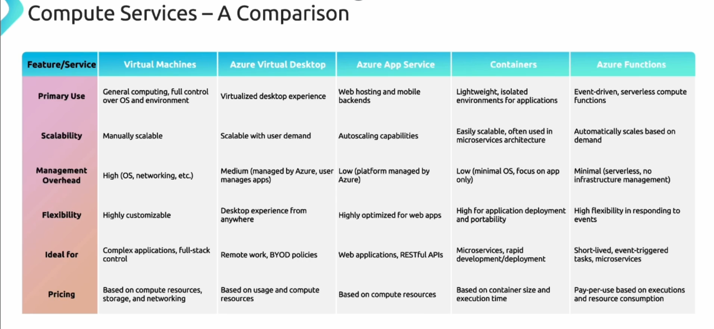
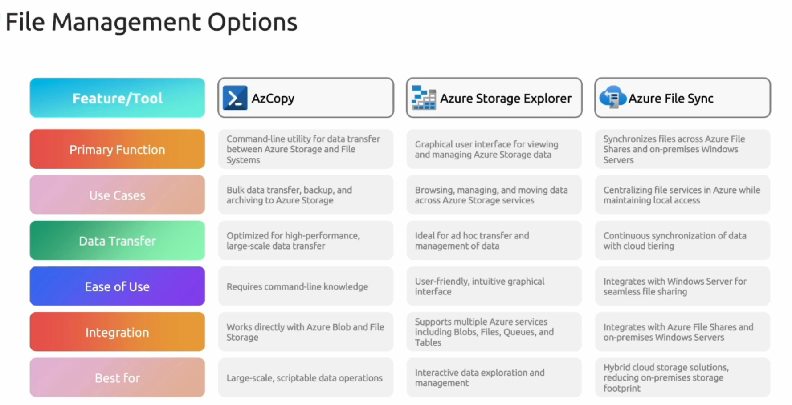
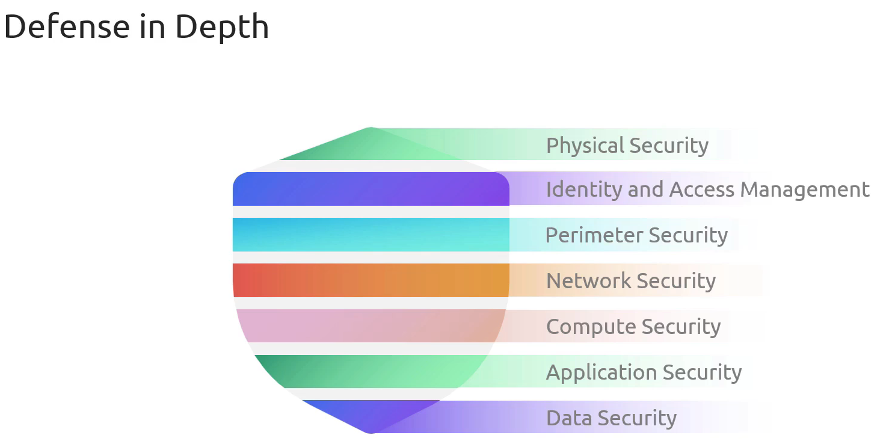
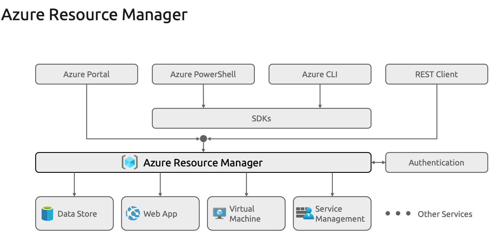

# AZ-900: Microsoft Azure Fundamentals

## Table of Contents
- [Curriculum](#curriculum)
  - [Cloud Concepts](#cloud-concepts)
    - [Cloud Models](#cloud-models)
    - [Capital vs Operational Costing](#capital-vs-operational-costing)
    - [Cloud Benefits](#cloud-benefits)
    - [Cloud Service Types](#cloud-service-types)
  - [Azure Architecture and Services](#azure-architecture-and-services)
    - [Core Architectural Components](#core-architectural-components)
    - [Azure Compute Resources](#azure-compute-resources)
    - [Azure Networking Resources](#azure-networking-resources)
    - [Azure Storage Resources](#azure-storage-resources)
    - [Azure identity access and security](#azure-identity-access-and-security)
  - [Azure Management and Governance](#azure-management-and-governance)
    - [Cost Management](#cost-management)
    - [Governance and Compliance](#governance-and-compliance)
    - [Resource deployment tools](#resource-deployment-tools)
    - [Monitoring Tools](#monitoring-tools)


## Curriculum
> - cloud concepts **(25–30%)**
> - Azure architecture and services **(35–40%)**
> - Azure management and governance **(30–35%)**

## Cloud Concepts

### **Cloud Models**

> #### Private Cloud:
- It provide Internal cloud Control:
    - Self Manage for infra, software and platform
    - More secure, No External Provider
    - Data center-based 
    - Full Control 
    - Limited & not scalable 

> #### Public Cloud:
- It provide remote cloud Control:
    - Provider Owned resources
    - Access resource through Internet Secure Connection
    - Limitless resources for growth
    - Quick Deploy, scale, price optimize
    - Capital free scaling
    - Pay as you go cost

> #### Hybrid Cloud:
- It provide Internal cloud Control + Public Cloud:
    - Optimize private data location 
    - Flexible app hosting
    - Regulation compliance
---

### **Capital vs Operational Costing**

> #### Operational Expenditure **(OpEx)**
- Description:
    - Day to day cost of running business operation
    - The more you use the more you pay
    - Flexible, No upfront cash
    - Fast paced market 

> #### Capital Expenditure **(CapEx)**
- Description:
    - initial investment in physical assets
    - High Upfront cost 
    - Long term investment
---

### **Cloud Benefits**
- High Availability: Available when needed
- Scalability
    - Horizontal scaling: add additional virtual machines
    - Vertical scaling: add more CPUs or RAM
- Reliability: the ability of a system to recover from failures and continue to function.
- Predictability
- Governance
- Security
- Elasticity
- Manageability
---

### **Cloud Service Types**

> #### Infrastructure as a Service `IaaS`:
- It provide Raw Infra of the cloud to use:
    - Complete Control over system
    - Cloud -> Servers, Networking
    - Client -> OS, Development, Apps
    - More Flexible and Scalable
- Ex: VMs

> #### Platform as a Service `PaaS`:
- It provide a platform and tools to deploy apps:
    - Cloud -> Servers, Networking, OS, tools
    - Client -> 
- Ex: App service, container service

> #### Software as a Service `SaaS`:
- It provide a software to use over the internet:
    - Cloud -> Servers, Networking, OS, tools, Development, Apps
    - Client -> use the software
- Ex: Outlook
---

## Azure architecture and services

### **Core Architectural Components**
> #### Regions and Availability Zones
- Regions Contain multiple AZs, Each AZ contain multiple Data Center
- ***Regional pair*** consists of two Azure regions within the same geopolitical boundary. that are linked together for replication and failover support.
    - Geopolitical Separation
    - Automated Replication
    - Prioritized Recovery
    - Sequential Update
- ***Sovereign regions***: physically and logically separated Azure cloud environments designed for specific governments or regulatory bodies. 
    - Sovereign regions are purpose-built for high-security, compliant workloads.
---

> #### Subscriptions and Resource Groups
- `Resource Groups`: Collection fo resources that are grouped together and managed as single Unit.  
    - More management & Flexibility
- `Subscriptions`: is a boundary where can manage resources and billing & Access Control Boundary
- `Management Groups`: Control, define & manage Azure Subscriptions and inherit conditions of the management group
- `hierarchical Depth`: 
```scss
📁 Management Group
   └── 📦 Subscription
       └── 🗂️ Resource Group
           ├── 🖥️ Virtual Machine
           ├── 📦 Storage 
           └── 🛢️ SQL Database
```
---

### **Azure Compute Resources**

> #### Virtual Machines
- VM is a server to use.
- Variate of sizes, Customizable, Flexible, Cost Effective
- `Network Connection` of VMs: 
    - Public endpoints
    - Private endpoints
    - Virtual Peering: private connection between 2 different networks
- `Availability Set`: feature that ensure app availability during planned/unplanned events
    - **Fault Domain**: protect from hardware failure. 3 Fault Domains
    - **Update Domain**: protect from plant maintenance. up to 20 update Domains
---

> #### Virtual Machine Scale Sets `VMSS`
- Service that allow you to manage set of Identical autoscaling VMs
    - Automatic Scaling & Load Balancing
    - High Availability
---

> #### Virtual Desktop `AVD`
- Enable you to remote access full desktop, Multi-sessions
- Flexible, Cost Effective and Scalable
- Used for remote work and use any device
---

> #### App Service `PaaS` 
- Fully managed Platform for building and deploying apps
- Multiple programming Languages
- Global Scaling & Integrated services
- Web apps API apps WebJobs Mobile apps
---

> #### Container Services `PaaS`
- Fully managed Platform for managing containers
- Types:
    - Container Instance: Fast, Easy, No VM, Simple uses and tasks
    - Container Apps **AutoScaling**: More Complex for Microservices
    - Kubernetes Services *AKS* **AutoScaling**
---

> #### Azure Functions `Serverless` ***`FaaS`***
- Let you run Event triggered code without explicitly manage Infra
- Even Driven
- Multiple Languages
- Types:
    - Durable Functions: is a framework (in Azure Functions) for writing stateful workflows in code.
    - Stateless Functions: Each invocation is independent.


---

> #### Compare
<div style="text-align: center;">

</div>
---

### **Azure Networking Resources**

> #### Virtual Networks
- Isolation and Segmentation
- Internet communication & on premises communication
- Security, Customization, Integrations with other services
- Communicate between Azure resources: Service endpoints Virtual networks
- Filter network traffic:
    - Network security groups are Azure resources
- Route network traffic:
    - Border Gateway Protocol (BGP) works with Azure VPN gateways, Azure Route Server, or Azure ExpressRoute to propagate on-premises BGP routes to Azure virtual networks.
    - Route tables allow you to define rules about how traffic should be directed.
---

> #### VPN Gateway
- Secure Encrypt Traffic
- Secure Azure to on-premises connections extension
- Types: Active/standby, Active/Active
- Site to site VPN: Connection between 2 Sites
- Point to site VPN: Connection between 1 client to site
-  policy-based or route-based:
---    

> #### Azure Express Route
- Azure ExpressRoute is a private, dedicated connection between your on-premises infrastructure (like a datacenter) and Microsoft Azure, bypassing the public internet.
    - Private & High speed Connection
    - Used for Hybrid cloud deployment
    - Compliance requirements
- ExpressRoute uses the BGP. BGP is used to exchange routes between on-premises networks and resources running in Azure.
---   

> #### DNS
- Hosting service for DNS domains
- Global Reach
- Records for Azure hosted apps
---   

### **Azure Storage Resources**

> #### Storage Account
- Storage solution for data
- Diverse Storage Options Sql, NoSql
- High Durability, Availability & Redundancy
- Types:
    - Standard general-purpose v2: All Redundancy Options
    - Premium block blobs, Premium page blobs: LRS, ZRS | LRS
    - Premium file shares: LRS, ZRS
---   

> #### Redundancy Options
- Replicate your data in multiple Location
- Options:
    - Locally redundant Storage (LRS): Replicate data 3 time in 1 Datacenter in 1 Region: 11*9
    - Zone redundant Storage (ZRS): Sync Replication across 3 AZs: 12*9
    - Geo redundant Storage (GRS): Replicate data to another secondary Region **LRS+LRS**: 16*9
    - Geo Zone redundant Storage (GZRS): sync replication across 3 AZs in primary Region and replicate data 3 times in 1 datacenter in secondary Region **ZRS+LRS**: 16*9
    - Read access to data in the secondary region:
        - read-access geo-redundant storage (RA-GRS)
        - read-access geo-zone-redundant storage (RA-GZRS)
---  

> #### Storage Services
- `Azure Blob`: Use *Containers* act as *Dir* to store UnStructure Data like Documents, Images, Videos
    - A massively scalable object store for text and binary data. 
    - Also includes support for **big data analytics** through `Data Lake Storage Gen2`.
- `Azure Disk`: Block-level storage volumes for Azure VMs like HDD, SDD
- `Azure Queue`: A messaging store for reliable messaging between application components. 
- `Azure Files`: Like File share mounted in you PC, but in the cloud
- `Azure Table`: NoSQL table option for structured, non-relational data.
- Access:
    - URL: *https://storage-acc-name.[blob,file,queue,table,dfs].core.windows.net*
    - URL: *https://storage-acc-name.blob.core.windows.net*
---  

> #### Access Tiers
- How Frequent you access your data:
    - `Hot`: Frequent access, higher cost
    - `Cool`: InFrequent access, Lower cost, Minimum Storage Duration: 30 days
    - `Cold`: Rare access, Lower cost, Minimum Storage Duration: 90 days  
    - `Archive`: Long-term storage, Lowest cost, Minimum Storage Duration: 180 days
---  

> #### Azure Migrate
- Tools to assets organizations to migrate workload from on premises to Azure
- Provide: Assessment Tools, Migrations Tools & Integration Tools 
- `Azure Migrate`: Server Migration. Migrate VMware VMs, Hyper-V VMs, physical servers,
- `Azure Database Migration Service`. Migrate on-premises databases to Azure VMs running SQL Server, Azure SQL Database, or SQL Managed Instances.
- `Azure App Service migration assistant`. Azure App Service migration assistant is a standalone tool to assess on-premises websites for migration to Azure App Service.
- `Azure Data Box` products to move large amounts of offline data to Azure.
---  

> #### Azure Data Box
- Service for moving Very Large amount of data to Azure
- Physical Devices for data transfer, Offline
- Migrating your VM farm, SQL server, and applications to Azure.
- Variants:
    - Data Box Disk: Small data 
    - Data Box: medium
    - Data Box Heavy: very large data amount
---  

> #### File Management Options
<div style="text-align: center;">

</div>
---  

### **Azure identity access and security**

> #### Microsoft Entra ID
- Formerly Microsoft Active Directory
- Provide Single Sign On `(SSO)`
    - MFA
    - condition access
    - B2B collaboration
    - App/Device Management
---  

> #### Microsoft Entra Domain services
- **Microsoft Entra Domain Services** is a companion service for **Microsoft Entra ID**— it gives you old-school, Windows-style features like domain join and Group Policy, for apps that still need them.
- For legacy apps/VMs that need domain join, Group Policy, Kerberos
- Used for active directory migrations, auth for legacy apps.
- Domain Join, Group Policy.
- Simple to use & Scalable.
--- 

> #### Authentication and Authorization
- `Authentication` by ***Microsoft Entra-ID***: Who are you: password & tokens
    - passwordless authentication options:
        - Windows Hello for Business
        - Microsoft Authenticator app
        - FIDO2 security keys
- `Authorization` by ***RBAC, Policy***: What can you do: roles, permissions & access control
- Fine grained access control, Compliance & governance
---  

> #### MFA & Conditional Access
- `MFA`: Adding another layer of authentication like sms, phone calls, email confirmation
- `Conditional Access`: Enforce access control based on conditions
    - Uses *Signals*: to collect info about the access like User, Location, Devices
    - Assess this signals then allow or deny access
    - Use Group/User Policies, Location Policies, Device-Based Policies & Risk-based Polices
--- 

> #### B2B & B2C
- Microsoft Entra External Identities `B2B`: To grant external user the access to your organization with defined access
    - Provide Cross-Organization collaboration
    - For Employee and Business Partners
- Microsoft Entra External Identities `B2C`: Make a customer access my App using an external source accost like social media, Github, icloud.
    - Provide personalized access
    - For End User & Consumers facing apps
---  

> #### RBAC & Zero Trust
- RBAC: For Authorization to answer **WHO, WHERE and WHAT**
    - Least Privilege
    - Strict access control
- Zero Trust: Protect all assets everywhere with citral policy
    - Verify Explicitly
    - Least Privilege access
    - Assume Breach
<div style="text-align: center;">

</div>

--- 

> #### Microsoft Defender for Cloud
- Detect Deter & Delay Threats
- Continuous Assessment & Threat Protection
- Automated Recommendation & Compliance Management
- Microsoft Defender plans are extended to non-Azure machines with the help of `Azure Arc`.
- `Cloud security posture management (CSPM)` features are extended to multicloud machines without the need for any agents.
--- 


## Azure management and governance

### **Cost Management**

> #### Factors Affecting Cost
- Type of Resource
- Consumption Model
- Lack of Maintenance
- Region
- Ingress & Egress
- Type of Subscription
---

> #### Azure Marketplace
- Digital shopping mall
- Provide wide range of digital products
---

> #### Pricing Calculator
- The pricing calculator is designed to give you an estimated cost for provisioning resources in Azure. 
- Budget Planning, Transparency and Flexibility
- Provide Scenario Based calculation
- Used when migration and differ between multiple Configuration
---

> #### Total Cost of Ownership `TCO` Calculator
- `Cost Comparison Tool`: Calculate the cost of having on premises infra to migrating to Azure
- Cost Analysis, Customized Inputs, Detailed Reports
- Planning tools for migrations
- Steps: Enter Current infra details -> specify future Azure Services -> View Reports
---

> #### Azure Cost Management
- Tools that Monitor, Allocate & optimize resource Cost 
- Provide Cost analysis & Recommendations
- Used to track cloud spending
- Cost alerts:
    - Budget alerts
    - Credit alerts
    - Department spending quota alerts.


---

> #### Resource Tags
- Used to group manage and Cost allocation for resources
- Good for usage Tracking and Automation
- Not Tag Inheritance from Resource Group to Resources
- This grouping helps you formulate service-level agreements (SLAs). An SLA is an uptime or performance guarantee between you and your users.
---

### **Governance and Compliance**

> #### Azure Policies
- Service that assist you in creating, assigning & Manage Policies to govern your resources
- We define policies and then assign it to Management Group, subscription or Resource Group
- Enforce compliance & prevent Config Drift
- `An Azure Policy initiative` is a way of **grouping related policies together**. The initiative definition contains all of the policy definitions to help track your compliance state for a larger goal.
---

> #### Resource Locks
- Prevent Resources accidentally deleted or modification
- Types: 
    - Read-only Lock
    - Delete Lock
---

> #### Service Trust Portal
- See how Microsoft protects your data &  Learn about security, privacy, and compliance for Microsoft cloud services 
- How Azure handling the compliance and how safe it is.
---

> #### Microsoft Purview
- Microsoft Purview is a family of **data governance,** risk, and compliance solutions
- it helps businesses discover, protect, and manage their data — no matter where that data lives
- Help in data discovery and classification
- Used for Data Governance & Audit & Insider Risk Management
- `risk and compliance solutions`: managing and monitoring your data,
- `Unified data governance`: help manage your on-premises, multicloud, and software as a service data.
    - Create an up-to-date map
    - Identify where sensitive data
---

### **Resource deployment tools**

> #### Tools for Interacting with Azure
- Azure Portal
    - Web-based & User friendly
    - Quick Task and Monitoring
- Azure PowerShell
    - Automation using command line: run commands called command-lets (cmdlets).
- Azure CLI
    - Automation using command line
- Azure Cloud Shell
---

> #### Azure Arc
- Azure Arc brings non-Azure machines into the Azure control panel, so you can manage everything in one place.
- Manage resource on premises and Multi cloud
- Used for Hybrid deployments & Centralized Management
---

> #### Azure Resource Manager `ARM`
<div style="text-align: center;">

</div>


> #### Infrastructure as Code
- Text base resource definition to automate the process of creating resource with minimal human intervention
- Azure Resources Management Templates: Json files 
- Azure Bicep: Domain specific Language for deploying resources, No state management, Easier to understand
---

### **Monitoring Tools**

> #### Azure Advisor
- Provide Tailored Recommendations and Best Practices related to resources
- Analyze Resource config then provide recommendations `Well Architected Framework Pillars`:
    - High Availability
    - Security
    - Performance 
    - Cost 
    - Operations Excellence: achieve process and workflow efficiency and deploy best practices.
---

> #### Azure Service Health
- Stay informed about problems with Azure services, Get alerts when there’s an outage or maintenance
- Component: 
    - Azure Status: Global Views and Real Time Status
    - Azure Service Health: It focuses on the Azure services and regions you're using. 
        - Personalized Alerts, Service Issues, Planned Maintenance & Health History
    - Azure Resource Health: Gain Detailed Insights about resources
---

> #### Azure Monitor
- Tool that collect, analyze and act based on findings of data 
- Data Collection, Alerts, Dashboard-Visualization, Logs & App Insights 
- `Azure Log Analytics` is the tool in the Azure portal where you’ll write and run log queries on the data gathered by Azure Monitor
- `Azure Monitor Alerts` are an automated way to stay informed when Azure Monitor detects a threshold being crossed.
    - Azure Monitor Alerts use action groups to configure who to notify and what action to take.
- `Application Insights` is an Azure Monitor feature, monitors your web applications.


## Notes:
- An Azure RBAC role is applied to a scope, which is a resource or set of resources that the access applies to. Resource locks prevent the accidental change or deletion of a resource. Resource tags are used to locate and act on resources associated with specific workloads, environments, business units, and owners. Policies enforce different rules across resource configurations so that the configurations stay compliant with corporate standards.
- We can deallocate VMs that will not be used in certain time 
- After an outage, Service Health provides official incident reports called root cause analysis (RCA), which you can share with stakeholders.
- A resource is a manageable item that is available through Azure. Virtual machines, storage accounts, web apps, databases, and virtual networks are examples of resources.
- Region pairs allow the replication of Azure resources across geographies to help ensure that a secondary region is available in case of any disaster at the primary region.
- Elasticity refers to the ability to scale resources as needed, such as during business hours, to ensure that an application can keep up with demand, and then reducing the available resources during off-peak hours. Agility refers to the ability to deploy new applications and services quickly. High availability refers to the ability to ensure that a service or application remains available in the event of a failure. Geo-distribution makes a service or application available in multiple geographic locations that are typically close to your users.
- The just-in-time (JIT) access feature in Microsoft Defender for Cloud allows you to lock down inbound traffic to your Azure Virtual Machines. This reduces exposure to attacks while providing easy access when you need to connect to a VM